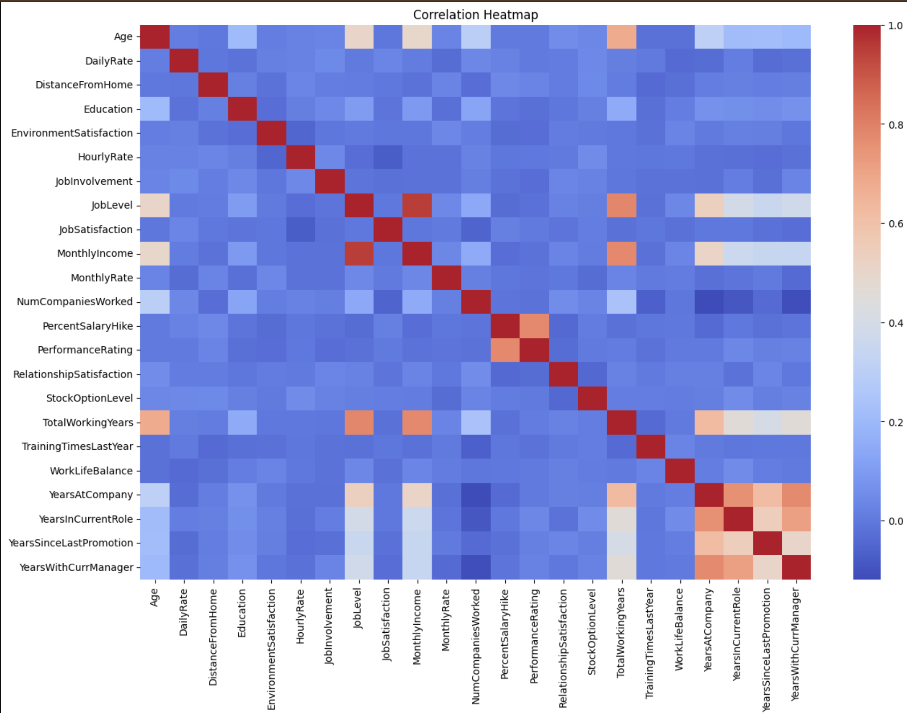
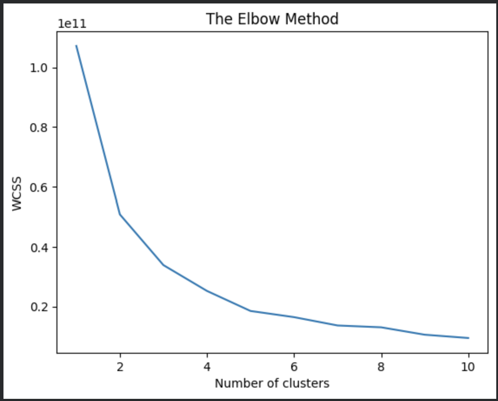
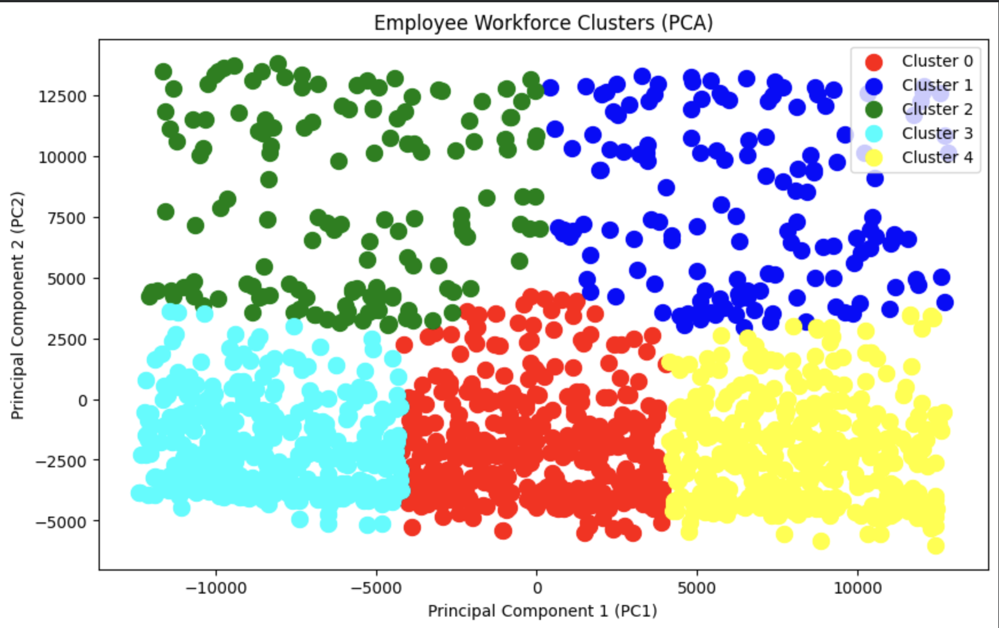
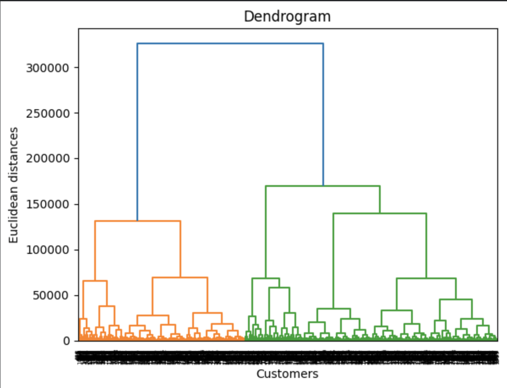
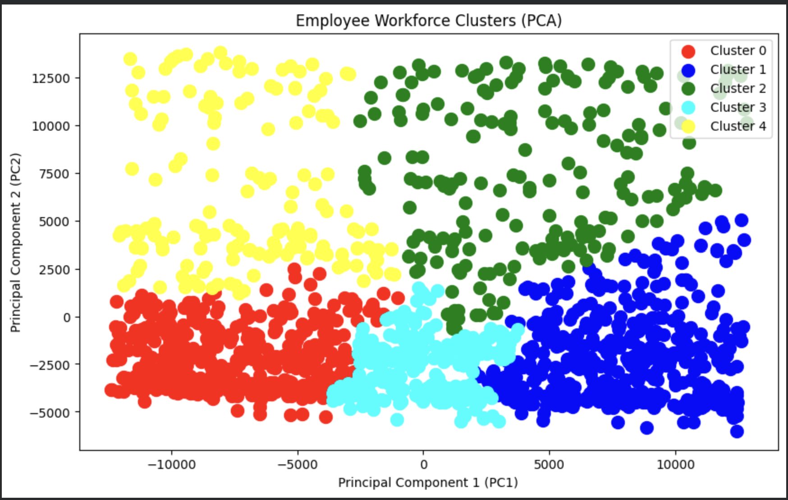

# Employee Workforce Segmentation using K-Means & Hierarchical Clustering

## Project Overview

Employee segmentation helps organizations understand different groups within their workforce based on employee characteristics, experience, income, and workplace satisfaction factors.

In this project, Unsupervised Machine Learning techniques were used to segment employees into meaningful groups. Both **K-Means Clustering** and **Hierarchical Clustering** were implemented and compared to identify the most effective clustering approach.

The project also uses **Principal Component Analysis (PCA)** for dimensionality reduction and cluster visualization.

---

## Objectives

* Perform workforce segmentation using clustering techniques.
* Identify meaningful employee groups based on professional and demographic characteristics.
* Compare K-Means and Hierarchical Clustering performance.
* Visualize employee clusters using PCA.
* Generate actionable workforce insights.

---

## Dataset

The dataset contains employee-related information such as:

* Age
* Monthly Income
* Total Working Years
* Years At Company
* Job Level
* Job Satisfaction
* Work-Life Balance
* Environment Satisfaction
* Relationship Satisfaction
* Training Times Last Year
* Distance From Home
* Business Travel
* Department
* Job Role
* Marital Status

### Features Removed

The following features were removed because they were identifiers, constants, target variables, or not useful for clustering:

* Attrition
* EmployeeNumber
* EmployeeCount
* StandardHours
* Over18
* Gender
* Education
* EducationField
* OverTime

---

## Exploratory Data Analysis (EDA)

EDA was performed to understand the dataset and identify important patterns.

### Key Visualizations

* Distribution Analysis
* Boxplots for Outlier Detection
* Correlation Heatmap
* Feature Relationship Analysis

### Sample Visualizations

#### Correlation Heatmap

---

## Data Preprocessing

### Categorical Encoding

Categorical features were converted into numerical format using One-Hot Encoding.

### Feature Scaling

StandardScaler was applied before clustering because distance-based algorithms are sensitive to feature magnitudes.

Without scaling, features such as Monthly Income could dominate the clustering process.

---

## K-Means Clustering

### Finding Optimal Clusters

The Elbow Method was used to determine the optimal number of clusters.

#### Elbow Method

Based on the elbow curve, 4–5 clusters appeared reasonable.

After experimentation, **5 clusters** were selected.

---

## PCA for Visualization

Principal Component Analysis (PCA) was applied to reduce the high-dimensional feature space into two principal components.

This allows visualization of employee clusters in a 2D space while preserving as much variance as possible.

### K-Means Cluster Visualization

### K-Means Results

* Number of Clusters: 5
* Silhouette Score: **0.43**

---

## Hierarchical Clustering

Agglomerative Hierarchical Clustering was implemented using Ward Linkage.

### Dendrogram

### Hierarchical Cluster Visualization

### Hierarchical Clustering Results

* Number of Clusters: 5
* Silhouette Score: **0.37**

---

## Model Comparison

| Algorithm               | Number of Clusters | Silhouette Score |
| ----------------------- | ------------------ | ---------------- |
| K-Means Clustering      | 5                  | 0.43             |
| Hierarchical Clustering | 5                  | 0.37             |

### Observation

K-Means achieved a higher Silhouette Score and produced better-separated employee segments compared to Hierarchical Clustering.

---

## Cluster Insights

The clustering process identified five distinct employee segments:

### Cluster 0

Early-to-mid career employees with moderate experience, lower job levels, and below-average income.

### Cluster 1

Highly experienced senior employees with the highest income and advanced job positions.

### Cluster 2

Experienced professionals with high income and long tenure, slightly below Cluster 1 in seniority.

### Cluster 3

Young-to-mid career employees with lower income, lower job levels, and relatively shorter organizational tenure.

### Cluster 4

Developing employees with moderate experience, improving career growth, and stable income levels.

> Cluster descriptions are based on the average characteristics observed within each cluster.

---

## Conclusion

This project successfully segmented employees into meaningful workforce groups using unsupervised learning techniques.

Key findings:

* Workforce segmentation can reveal hidden employee patterns.
* K-Means Clustering outperformed Hierarchical Clustering.
* PCA provided effective visualization of employee groups.
* Five meaningful workforce segments were identified.

The results demonstrate how clustering techniques can support workforce analytics, talent management, and strategic HR decision-making.

---

## Technologies Used

* Python
* Pandas
* NumPy
* Matplotlib
* Seaborn
* Scikit-Learn
* PCA
* K-Means Clustering
* Hierarchical Clustering

---

## Future Improvements

* Experiment with DBSCAN and Gaussian Mixture Models (GMM).
* Perform advanced feature engineering.
* Integrate employee performance metrics.
* Build an interactive dashboard using Streamlit or Power BI.

---

## Author

**Yasheel Patidar**

GitHub: `yasheel-ml`
